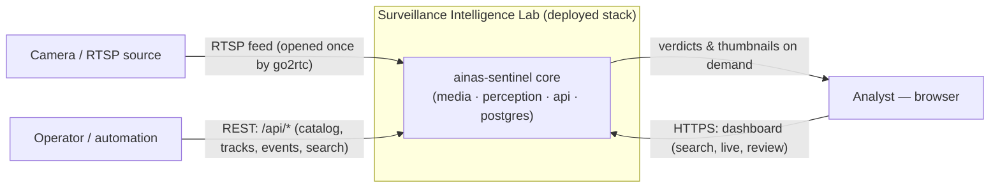
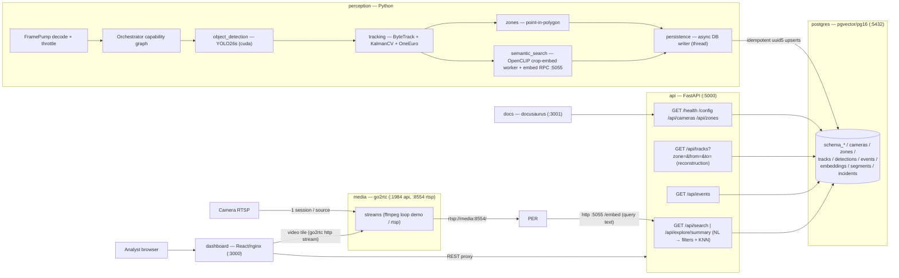
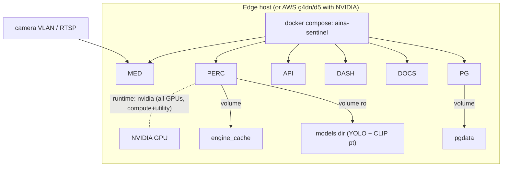
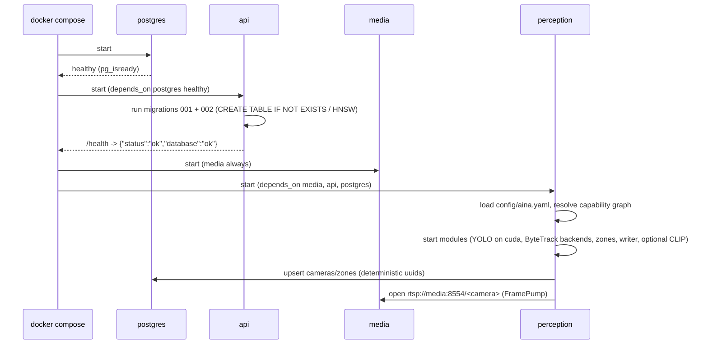
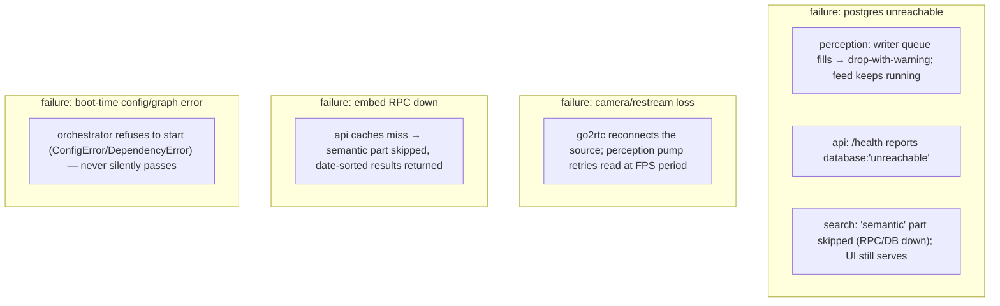

# High-Level Design — Surveillance Intelligence Lab

Version 1.0 (2026-08-31). Companion to [`LLD.md`](./LLD.md) (down-level details)
and [`SAMPLE_RUN.md`](./SAMPLE_RUN.md) (worked example). Review-only; reflects
committed state (`6570962`, 137 tests).

## 1. Purpose & goals

A 24/7 camera analytics platform ("Predict. Protect. Verify.") that:

1. Ingests one or more RTSP cameras through a **single restream** (go2rtc).
2. Runs **local, on-prem** perception on an NVIDIA GPU — object detection
   (YOLO26s), multi-object tracking (ByteTrack port + Kalman/One-Euro
   smoothing), zone membership, and **local CLIP embeddings** (OpenCLIP
   ViT-H-14) for semantic search. No cloud vision/embedding APIs.
3. Persists **idempotently** (deterministic uuid5 + `ON CONFLICT`) to
   Postgres+pgvector so replay and long uptime are safe.
4. Serves catalog, event reconstruction ("who was in zone X between A and B"),
   and **NL semantic search with structured filters + pgvector KNN**.

### Non-functional drivers

| Driver | Target |
|--------|--------|
| Never lose the camera feed | Perception never crashes the pipeline; downstream sinks drop-with-warning |
| Real-world time consistency | Capture timestamps flow end-to-end; Kalman/One-Euro/db all step by real dt |
| Data integrity | Deterministic ids → idempotent writes, crash-replay safe |
| Operator simplicity | One YAML (`config/aina.yaml`); capability graph auto-enables upstreams |
| Model freedom | Detector, tracker, embedder all swappable behind registries; torch-free test host |

## 2. System context (C4 L1)



External dependencies: **none required** — model weights come from a mounted
`models` volume; everything else is self-contained. (A real camera feed is the
only external input.)

## 3. Containers (C4 L2)



**Container contract highlights**

- `perception` is the only consumer of the restream; `dashboard` grabs the same
  stream as an HTTP `<video>` tile directly from go2rtc.
- `api` **never imports torch** — query text is embedded by calling the
  perception container's tiny `/embed` RPC (one model, one home).
- `perception` mounts GPU (nvidia runtime), engine cache, and the models dir;
  `api`/`dashboard`/`docs` are CPU-only.

## 4. Deployment topology



**Boot/health flow**



Environment toggles: `AINA_FPS` (1–30, default 10), `AINA_INGEST=rtsp` turns the
ingest loop on, `DEPLOYMENT_TARGET=edge|aws` selects the base image + GPU
assumption, `AINA_FAIL_FAST=1` re-raises per-frame errors (dev).

## 5. Perception data flow (end-to-end)

```mermaid
flowchart LR
    subgraph frame["one Frame (10–30/s/source)"]
        F["Frame{source, frame_id, timestamp=decode-wallclock, image BGR}"]
    end
    F --> OD["object_detection<br/>YOLO26s imgsz=640 conf=0.25<br/>xyxy back to source pixels"]
    OD -->|"Detections[]"| DS["sv.DetectionsSmoother (optional<br/>version-adaptive, pass-through fallback)"]
    DS --> TR["tracking<br/>ByteTrack 2-stage assoc (dt-Kalman)<br/>render = One-Euro(KalmanCV(state))"]
    TR -->|"tracks[]: render + raw boxes, gid (global)"| ZN["zones<br/>feet-point point-in-polygon"]
    TR -->|"tracks"| SE["semantic_search (optional)<br/>best-confidence crop → CLIP worker → 1024-d<br/>rows drained off hot path"]
    ZN -->|"zone_membership"| PB["persistence (hot-path enqueue only)"]
    SE -->|"embeddings rows"| PB
    PB -->|"bounded queue"| WR["writer thread<br/>FIFO · executemany · commit/200"]
    WR -->|"idempotent upserts"| DB[("Postgres + pgvector")]
```



All boxes inside the graph run **once per frame per source** in topological
order; shared capability results are computed once and broadcast to consumers
(structural dedup, see LLD §2).

## 6. Data model (summary)

```mermaid
erDiagram
    cameras ||--o{ zones : "owns (cascade)"
    cameras ||--o{ tracks : "records"
    cameras ||--o{ detections : "records"
    cameras ||--o{ events : "logs"
    cameras ||--o{ segments : "windows"
    cameras ||--o{ incidents : "log"
    tracks ||--o{ detections : "per-frame samples"
    tracks ||--o{ events : "zone/behavior lifecycle"
    tracks ||--o{ embeddings : "CLIP vectors (pgvector)"
    zones ||--o{ events : "target zone"

    cameras { uuid id PK }
    zones { uuid id PK, jsonb polygon }
    tracks { uuid id PK, int global_track_id, text tracker_backend, timestamptz first_seen_at, timestamptz ended_at, jsonb last_box }
    detections { bigserial id PK, bigint frame_idx, float8 x1y1x2y2, float8 confidence }
    events { uuid id PK, text event_type, timestamptz started_at, timestamptz ended_at, text severity }
    embeddings { uuid id PK, text model, vector embed_vector, jsonb meta }
```

Key semantics:

- `tracks` = one object **identity lifecycle**, upserted per live frame
  (`frames_seen`, `coasted_frames`, `peak_confidence`, `last_box`, `ended_at`).
- `detections` = per-frame samples, kept lean by `detection_sampling`.
- `events` = lifecycle rows keyed by `event_type`
  (`entered_zone`/`left_zone`, plus behavior types). The open/close pair is the
  source of truth for interval reconstruction (`tstzrange &&` overlap).
- `embeddings` = 1024-d cosine space, HNSW indexed; `meta` carries confidence +
  `captured_at` + base64 thumbnail (kept out of the hot KNN scan).
- Every client-side id is `uuid5(ns, "<kind>:<camera>[:<zone>][:<gid>][:<ts>]")`
  → upsert/replay idempotent (LLD §5 lists the exact formulas).

## 7. API surface

| Endpoint | Purpose |
|----------|---------|
| `GET /` | product banner |
| `GET /health` | liveness + DB reachability (never 500s if DB down) |
| `GET /config` | deployment target echo |
| `GET /api/cameras` | camera catalog |
| `GET /api/zones` | zone catalog (camera, name, polygon) |
| `GET /api/tracks?camera&zone&from&to` | **reconstruction**: tracks active in camera/zone during a window |
| `GET /api/events?camera&since&limit` | event feed |
| `GET /api/search?q&camera&zone&label&event&from&to&similar&sort&limit` | **semantic search**: structured filters first, then pgvector cosine KNN (relevance) or date; `similar=<embedding_id>` = "find like this" |
| `GET /api/explore/summary` | label → embedding counts for the Explore grid |

Search order of operations: NL parse → structured filters (camera/zone/label/
event/window) → optional query text → embed via perception RPC (cached 300 s) →
`WHERE` filters → KNN `e.vector <=> '<vec>'::vector` → return thumbnails +
similarity (`1 − dist`).

## 8. Quality attributes & failure isolation



## 9. Security & operations notes

- Streams and analytics are **local-only**; external interfaces are :3000
  (dashboard), :5000 (api), :3001 (docs), :1984 (media) — intended for a
  private/VPN network today; auth/zero-trust is an open hardening item.
- `CORS allow_origins=*` on the API — revisit when adding auth.
- No secrets in the repo (DB password via env/`.env`; camera credentials in
  `config/aina.yaml` / `go2rtc.yaml`).
- Model weights and engine cache are mounted volumes — CI/edge hosts should pin
  weights by hash for reproducibility (open item).

## 10. Scaling trajectory

| Trigger | Change |
|---------|--------|
| >2 cameras | per-camera decode threads + bounded frame queues; overlap decode with GPU infer |
| Sustained dense scenes | keep `detection_sampling` ≥ 5; batch upserts (already commit/200) |
| Long retention | partition `detections` by ts; thumbnail blobs to object store with `meta` pointer |
| Multi-node | move api to replicas behind LB; perception per-camera shard; postgres stays single (write amp is low) |
| Auth | reverse-proxy + token before the dashboard/api |