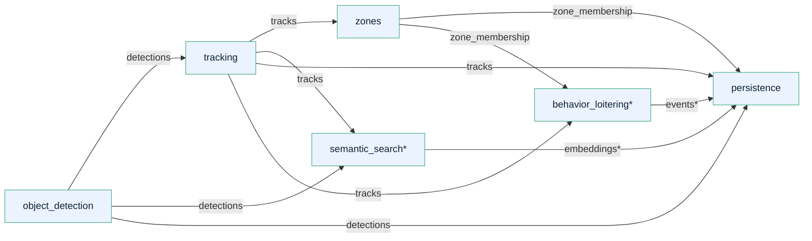
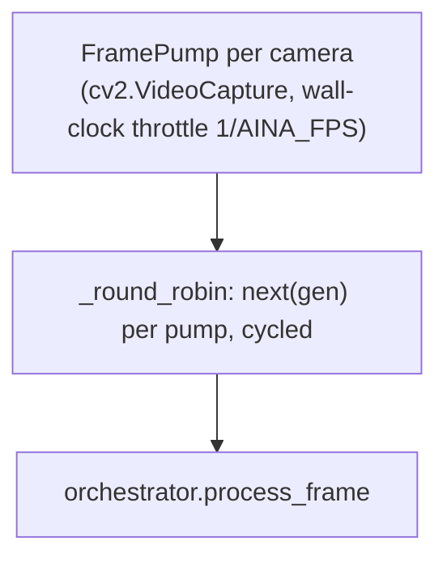
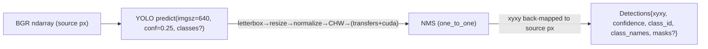
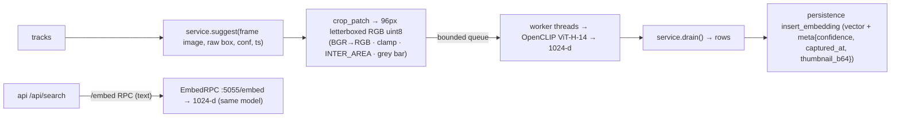
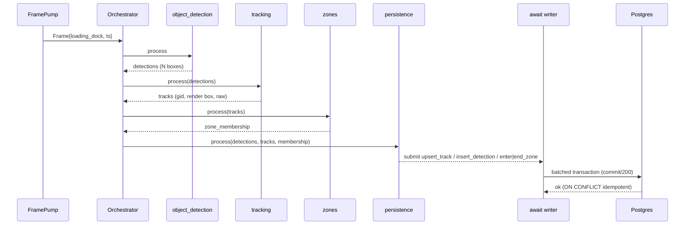

# Low-Level Design — Surveillance Intelligence Lab

Version 1.0 (2026-08-31). Down-level companion to [`HLD.md`](./HLD.md).
References committed code (`6570962`, 137 tests). Review-only.

---

## 1. Package layout

```
perception/
  orchestrator.py            capability graph, topology sort, per-frame run, CLI boot
  ingest.py                  FramePump (decode + throttle), go2rtc url, round robin
  config_schema.py           aina.yaml dataclasses + validation + auto-enable resolver
  modules/base.py            Capability, Frame, PerceptionModule contract (ABC)
  modules/object_detection.py   detections (detector pluggable)
  modules/tracking.py           tracks (ByteTrack/IoU backend pluggable, smoothing stack)
  modules/zones.py              zone_membership (feet-point PIP)
  modules/behavior_loitering.py events (optional)
  modules/embeddings.py         embeddings (CLIP crop worker + embed RPC)
  modules/persistence.py        sink → DatabaseWriter ops
  detectors/                 base + UltralyticsBackend (+ rfdetr stub)
  trackers/                  base + ByteTrackBackend (+ IoU backend)
  smoothing/                 detection_smoother · kalman (KalmanCV) · one_euro
  embeddings/                embedder · openclip backend · crop · service · rpc
  persistence.py             DatabaseWriter (queue + consumer thread) + id helpers
platform/api/                main.py (FastAPI) · search.py (NL→KNN) · nl.py · db.py
```

**Rules that hold structurally** (enforced by tests + code review):

- A module never imports another module; it declares `requires()`/`produces()`
  capability *keys* and reads only `upstream[key]`.
- Compute is deduped by construction: one producer per key, or broadcast
  producers each run once and consumers share the cached value.
- Registry stubs with `implemented=False` refuse to boot when enabled.

---

## 2. Capability graph & orchestrator



`*` = optional; enabled only when configured. `persistence` gates its
`requires()` dynamically (`_behavior_events`, `_embedding_sinks` injected by the
orchestrator) so it never auto-enables a toggled-off producer.

Default resolution (`config/aina.yaml`):
`requested = {object_detection, tracking, zones, persistence}` →
`resolve_enabled` auto-adds nothing (chain is complete) → execution order
`[object_detection, tracking, zones, persistence]`.

### Orchestrator lifecycle

1. `Orchestrator.__init__` discovers `requires()`/`produces()` from the whole
   registry using cheap probes (no model load).
2. Overrides shadow registry producers for the same capability keys
   (test seams; "one compute per key by construction").
3. `resolve_enabled` closes the closure of dependencies; logs each auto-enable.
4. `_reject_unknown_requested` / `_reject_unimplemented` → **fail-fast boot**.
5. Instantiate enabled modules, inject cross-cutting params
   (`_sources`, `_zones_by_source`, `_camera_defs`, `_tracking_backend`,
   `_behavior_events`, `_embedding_sinks`), set `module.smoothing`.
6. Kahn topological sort (`_topological_sort`), then `module.start()` each
   (heavy loads happen here, never during graph build).
7. `process_frame(frame)` → run schedule, `upstream = {k: results[k]}` cached per
   frame; every module runs exactly once.

### Scheduler (ingestion)



- Multi-camera interleave is single-threaded today (review item: per-camera
  decode threads at >2 cams — `docs/INGESTION_STAGE_REVIEW.md`).
- `AINA_INGEST=rtsp` arms the loop; otherwise perception idles (simple
  smoke/relaunch mode).

---

## 3. Stage internals

### 3.1 Detector preprocess (`detectors/ultralytics_backend.py`)



- `device` = configured or `cuda:0` if `torch.cuda.is_available()`.
- Lazy torch import keeps other contexts free; `DetectorError` guides install.
- Class names memoized from `model.names`.

### 3.2 Detection smoothing (`smoothing/detection_smoother.py`)

Version-adaptive wrapper over `sv.DetectionsSmoother`:

```
params → class_agnostic=False
       + length_seconds OR history_length OR length (whichever the installed SV exposes)
```

Prefer `smooth_with_mask` when present; on `ImportError/AttributeError/TypeError`
or a runtime exception → **pass-through** (never crashes the pipeline).

### 3.3 Tracking (`modules/tracking.py`, `trackers/byte_track.py`)

Per-frame flow:

```mermaid
sequenceDiagram
    participant T as Tracking.process
    participant B as ByteTrackBackend
    participant K as KalmanCV (render)
    participant E as BoxOneEuro (render)
    T->>T: merge broadcast detections (concatenate arrays)
    T->>T: measure FPS (EMA over capture-ts deltas)
    T->>B: set_max_lost_frames(round(buffer_seconds × fps))
    T->>B: update(frame_id, ts, xyxy, conf, cls)
    B->>B: predict every track by real dt (px/s)
    B->>B: stage1 high matches (≥ track_thresh) Hungarian IoU(class-aware)
    B->>B: stage2 low matches (0.1..thresh) on leftovers
    B->>B: matched → kf.update; unmatched → lost_count++ or drop; new high → spawn
    B-->>T: TrackState[] (raw/predicted boxes, lost, age)
    loop per track
        T->>T: gid = _gid_for(source, local) (global namespace)
        T->>T: dt = ts − last_render_ts
        alt coasted (no detection)
            T->>K: kalman.predict(dt)  (or backend prior / last render)
        else detection
            T->>K: predict(dt) then update(raw_box)
        end
        alt one_euro_filter on
            T->>E: apply(box, ts) seeded freq=measured fps
        end
        T-->>T: Track{track_id=gid, render xyxy, raw xyxy, confidence, ...}
    end
    T->>T: prune smoothers for dead tracks
```

State maps keyed `(source, gid)`; `_prune` bounds them. GID high-water resets on
restart (known caveat → `docs/INGESTION_STAGE_REVIEW.md` §4).

KalmanCV (`smoothing/kalman.py`): state `(cx, cy, w, h, vx, vy)`,
`F[0,4]=F[1,5]=dt`, velocity-process-noise `∝ dt` → gliding at true heading.

BoxOneEuro (`smoothing/one_euro.py`): 4 independent low-passes; adaptive
`cutoff = min_cutoff + beta·|dx̂|`; `freq` = measured FPS; dt from timestamps.

### 3.4 Zones (`modules/zones.py`)


Zones polygons are in the camera's pixel space (validated ≥ 3 vertices at config
load). Custom ray-cast chosen over `sv.PolygonZone` after an in-container bench
(2–7× faster ≤ ~20 tracks).

### 3.5 Semantic search (`modules/embeddings.py`, `embeddings/*`)



- Embedding runs **off** the hot path (`suggest` enqueues; `drain` consumes).
- `EmbedRPC` exposes the same embedder so query text and thumbnails live in one
  vector space; the API image stays torch-free (RPC + 300 s TTL cache).

### 3.6 Persistence (`modules/persistence.py`, `persistence.py`)

```mermaid
sequenceDiagram
    participant ML as Persistence.process (hot path)
    participant Q as bounded queue (20 000)
    participant T as writer thread
    participant DB as Postgres
    ML->>Q: submit(op dict) put_nowait (non-blocking; Full → dropped counter)
    Note over Q,T: single consumer, FIFO ⇒ enter→end zone ordering preserved
    T->>T: accumulate pending; batch at 200 committed statements
    T->>DB: transaction: executemany(insert_detection) + ordered per-op upserts
    DB-->>DB: idempotent via uuid5 + ON CONFLICT DO NOTHING/UPDATE
    T->>T: on failure: close conn, drop batch w/ warning (retry-once on open)
```

Ops emitted per frame: `upsert_track` × tracks (with `frames_seen`/`coasted`
deltas, peak confidence, tracker backend, last_box), `insert_detection` (sampled
`frame_idx % detection_sampling == 0`, raw box), `enter_zone`/`end_zone`,
`finalize_track` (`ended_at` after `finalize_timeout_s` unseen), plus behavior/
embedding rows when producers exist. `tracks.ended_at` cleared on upsert
(reopened track).

---

## 4. Threading & concurrency model

| Context | Concurrency |
|---------|-------------|
| Ingest → orchestrator | 1 thread (decode + infer serial). Round-robin across sources. |
| Persistence writer | 1 daemon thread owns the psycopg connection; `stop()` flushes + joins (10 s). |
| Embedding service | bounded worker pool (crops dequeued, embedded, drained); `EmbedRPC` HTTP server on :5055. |
| API | FastAPI async event loop; long-lived psycopg conn guarded by cursor ping + reset (`get_conn`). |
| go2rtc | independent process; owns all RTSP sessions. |

Shared-state note: the writer's `dropped`/`written` counters are plain ints
(append-only from one thread) — best-effort metrics (LLD hardening: expose them).
Buffers that must stay bounded: writer queue (20 000), embed queue
(`max_queue`), embed/query TTL cache (64 entries).

## 5. Deterministic identity scheme

Namespace:

```
AINA_NS = uuid5(DNS, "aina-sentinel.hypotenuse.ai") = e20cf932-400a-5d99-ac90-04aed3583d42
```

| Entity | uuid5 name | Uniqueness |
|--------|-----------|------------|
| camera | `camera:<name>` | per name |
| zone | `zone:<camera>:<zone>` | per camera+zone |
| track | `track:<camera>:<gid>` | per camera+global id |
| zone event | `enter:<camera>:<zone>:<gid>:<started_ts:.6f>` | per episode |
| behavior event | `event:<type>:<camera>:<zone>:<gid>:<started_ts:.6f>` | per episode+type |
| embedding | `embed:<camera>:<gid>:<model>:<captured_ts:.6f>` | per capture+model |

Reasons: zero-lookup upserts, conflict-free replay, joinable across tables
without id caches, and `ON CONFLICT` makes every idempotent write a no-op.

## 6. Database schema (as migrated)

Migrations: `platform/migrations/001_schema.sql`, `002_embeddings_knn.sql`,
run by the API on startup (`db.migrate()`, tracked in `schema_migrations`).

```sql
-- essentials (full DDL in 001_schema.sql)
cameras   (id uuid PK, name UNIQUE, source, enabled, want_fps)
zones     (id uuid PK, camera_id FK→cameras CASCADE, name, polygon jsonb, UNIQUE(camera_id,name))
tracks    (id uuid PK, camera_id FK, global_track_id int, tracker_backend text,
           class_id int, class_name, first_seen_at, last_seen_at, ended_at,
           frames_seen int, coasted_frames int, peak_confidence, last_box jsonb,
           UNIQUE(camera_id, global_track_id); idx (camera_id, last_seen_at))
detections(id bigserial PK, camera_id FK, track_id FK nullable, ts, frame_idx bigint,
           x1..y2 float8, confidence, class_id, class_name; idx (camera_id, ts))
events    (id uuid PK, camera_id FK, track_id/zone_id FK, event_type CHECK IN (visible,
           entered_zone, left_zone, stationary, loitering, tailgating, active, gone, external),
           started_at, ended_at, severity, reviewed, data jsonb; idx camera_type_start,
           track, zone, open_zone partial)
embeddings(id uuid PK, track_id FK CASCADE, model text, vector vector(1024), meta jsonb,
           created_at; idx (track_id); HNSW (model, vector vector_cosine_ops))
segments / incidents  -- window aggregations (review rail; schema only)
```

`embeddings.meta` carries `confidence`, `captured_at` (epoch float), and
`thumbnail_b64` (data URI) — thumbnails ride on the search projection, never in
the KNN nearest-neighbour IO path beyond purpose.

## 7. Config contract (`config_schema.py`)

```yaml
deployment: {target: edge|aws, gpu: bool}
cameras:    [{name, source, zones: [{name, polygon: [[x,y]...]}]}]
capabilities:
  object_detection: {enabled, framework, model, image_size, confidence, device_head}
  tracking:         {enabled, backend: bytetrack|iou, track_buffer_seconds, iou_threshold, track_thresh}
  zones:            {enabled}
  behavior:         {loitering: {...}, tailgating: {...}}   # flattened behavior_* keys
  semantic_search:  {enabled, embedding_model, device, rpc_port, refresh_seconds, ...}
  persistence:      {enabled, detection_sampling, finalize_timeout_s, database?}
smoothing:          {detection_smoother, one_euro_filter, render_interpolation,
                     min_cutoff, beta, d_cutoff}
```

Validation fails fast with `ConfigError` (bad polygon, unknown backend, bad
smoothing toggles, etc.). Range validation on relevant params (FPS 1–30,
iou (0,1], track_thresh (0,1], positive ints).

## 8. Error-handling matrix

| Layer | Failure | Behavior |
|-------|---------|----------|
| Config/start | bad YAML, unknown module, missing producer, unimplemented stub, cycle | `process` exits 1, loud log, **no partial run** |
| Ingest open | source can't open | `IngestionError` → exit 1 (loud boot) |
| Ingest read (hot) | transient decode fail | sleep one period, retry forever (reopen = open hardening item) |
| Detector | torch/cuda missing | `DetectorError` at `start()` → boot refused with guidance |
| Detector infer | model exception | per-frame `logger.exception`, counter continues (with `AINA_FAIL_FAST=1` re-raise) |
| Detection smoother | supervision absent/failure | pass-through, warning |
| Tracking | none expected | coercion ValueError on thresholds at configure |
| Persistence enqueue | queue full | drop + throttle-warn counter |
| Persistence commit | DB down | close conn, drop batch, reconnect up to 3 tries on next batch (retry-batch = hardening item) |
| Zone PIP | degenerate poly | validated at config; div-by-zero guarded by `or 1e-12` |
| Embed service | model/RPC fail | module disables itself (`semantic_search disabled`) — graph still runs |
| API | DB down | `/health` reports, query endpoints → 503 `DbUnavailable`, no 500 |
| API | embed RPC down | semantic part skipped, date-sorted results returned |

## 9. Monitoring hooks (as built)

- Logs: `aina.*` loggers, INFO readiness lines
  (`orchestrator ready` + module table, `tracking backend ready`, YOLO device
  proof, `persistence writer started ...`).
- GPU proof: `nvidia-smi` header logged at perception boot
  (`_print_gpu_proof`).
- Counters: `DatabaseWriter.dropped` / `.written`, frame/detection counts in the
  ingest loop log line (~3×/s).
- Open item: expose these on `/health`/metrics + per-camera fps heartbeat
  (see review punch list).

## 10. Key sequence: frame → row (condensed)

