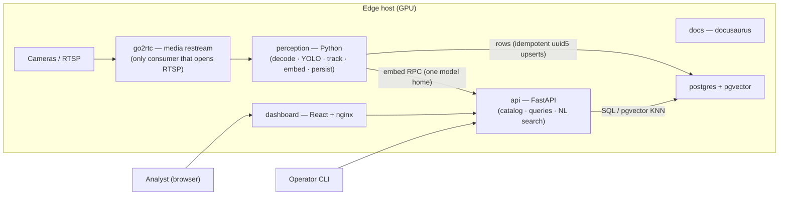

# Architecture & Design Docs — Surveillance Intelligence Lab (Hypotenuse Analytics)

Engineering documentation for the deployed stack (`docker compose` project
`aina-sentinel`, origin `github.com/Necrosyth/hypotenuse`).

Rendered GitHub markdown (Mermaid diagrams render natively on GitHub and in most
markdown viewers — docusaurus needs the mermaid plugin enabled to show them).

## Index

| Doc | Scope |
|-----|-------|
| [`HLD.md`](./HLD.md) | High-level design — system context, containers, deployment topology, data model, API surface, data flows, scaling & security. Decision makers / on-boarding. |
| [`LLD.md`](./LLD.md) | Low-level design — package layout, module contract & capability graph, orchestrator scheduling, tracking/smoothing internals, id scheme, persistence writer protocol, DB schema, threading model, error-handling matrix, key sequence diagrams. |
| [`SAMPLE_RUN.md`](./SAMPLE_RUN.md) | A worked end-to-end run — boot → frame 0 → detections → tracking → zone event → embedding → Postgres rows → a semantic search query, with concrete UUIDs and a frame-by-frame row timeline. |
| [`../INGESTION_STAGE_REVIEW.md`](../INGESTION_STAGE_REVIEW.md) | Production-readiness review of the ingestion + preprocessing stage (gap list, punch list). |

## System at a glance

**Flow in one sentence:** each camera is opened exactly once by go2rtc and
restreamed; the perception container decodes the restream, runs YOLO → ByteTrack
→ zone / CLIP embedding, and idempotently writes tracks/detections/events/vectors
to Postgres; the API serves catalog, reconstruction, and pgvector-KNN semantic
search to the dashboard.

### Stack

| Layer | Tech | Where |
|-------|------|-------|
| Media | go2rtc (RTSP/HTTP restream, ffmpeg loop for demo) | `media/go2rtc.yaml` |
| Perception | Python 3.14 · OpenCV · ultralytics YOLO26s · own ByteTrack port · numpy Kalman/One-Euro · supervision (optional) · OpenCLIP ViT-H-14 (1024-d) · psycopg | `perception/` |
| API | FastAPI · psycopg · pgvector `<=>` cosine KNN · NL query parser | `platform/api/` |
| Storage | postgres 16 + pgvector, HNSW index | `platform/migrations/001_schema.sql`, `002_embeddings_knn.sql` |
| UI / docs | React (Vite/nginx) · docusaurus | `dashboard/`, `docs/` |
| Orchestration | docker compose, nvidia runtime, engine cache + models volumes | `docker-compose.yml`, `deploy/` |

### Configuration entry points

- `config/aina.yaml` — cameras, capabilities graph, smoothing stack (operator-edited).
- Env — `AINA_FPS` (pipeline fps, default 10), `AINA_INGEST=rtsp`, `GO2RTC_HOST`,
  `POSTGRES_*`, `PERCEPTION_GPU_INDEX`, `DEPLOYMENT_TARGET=edge|aws`, `AINA_MODELS_DIR`.